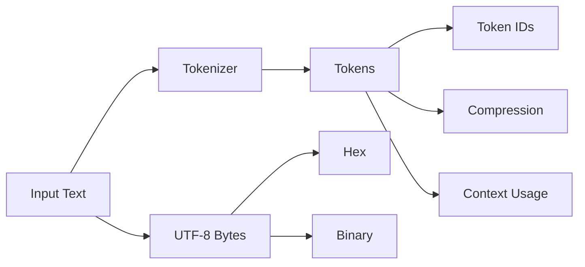

# TokenLab

<p align="center">
  <strong>Interactive LLM Tokenization & Encoding Laboratory</strong>
</p>

<p align="center">
  Explore how text becomes tokens, token IDs, bytes, hexadecimal, and binary — all through synchronized visualizations.
</p>

<p align="center">
  
</p>

---

## Overview

**TokenLab** is an interactive browser-based laboratory for understanding how language is transformed before it reaches an LLM.

Enter any text, select a tokenizer, and follow the same input through multiple representations:

```text
Text
  ↓
Tokens
  ↓
Token IDs
  ↓
UTF-8 Bytes
  ↓
Hexadecimal
  ↓
Binary
```

Every representation stays synchronized, making it possible to inspect exactly how individual pieces of text map across the pipeline.

Everything runs locally in the browser — **no backend and no API key required.**

---

## Features

|                         |                                                                                |
| ----------------------- | ------------------------------------------------------------------------------ |
| **Synchronized Views**  | Explore the same token stream as text, token IDs, bytes, hex and binary        |
| **Interactive Mapping** | Hover or lock a value to highlight its corresponding representation everywhere |
| **Byte Inspector**      | Inspect UTF-8 bytes, hexadecimal, binary and high/low nibbles                  |
| **11 Tokenizers**       | Compare GPT, Llama, Claude, Gemini, DeepSeek, BERT and byte-level tokenization |
| **Model Comparison**    | Compare token counts across different tokenizer families                       |
| **Compression Lab**     | Visualize dictionary-based compression and storage overhead                    |
| **Context Budget**      | See token usage and characters-per-token efficiency                            |
| **Export**              | Export the current analysis as JSON or CSV                                     |
| **Glossary**            | Built-in explanations for tokenization and encoding terminology                |

---

## Tokenization Pipeline

TokenLab makes the transformation interactive rather than treating tokenization as a black box.



Select any token and trace it across the different representations.

---

## Supported Tokenizers

| Model / Engine    | Family         | Vocabulary | Context |
| ----------------- | -------------- | ---------: | ------: |
| GPT-1             | BPE            |        40K |     512 |
| GPT-2             | Byte-level BPE |     50,257 |   1,024 |
| GPT-3             | Byte-level BPE |     50,281 |   4,096 |
| GPT-4 / 3.5       | BPE            |       100K |   8,192 |
| GPT-4o / o1       | BPE            |       200K |    128K |
| Llama 3.1 / 3.2   | Byte-level BPE |    128,256 |    128K |
| Claude 3.5 Sonnet | Byte-level BPE |       ~65K |    200K |
| Gemini 1.5 / 2.0  | SentencePiece  |       256K |      1M |
| DeepSeek-V3 / R1  | Byte-level BPE |       128K |    128K |
| BERT              | WordPiece      |     30,522 |     512 |
| ByT5 / Raw Bytes  | Byte stream    |        256 |   1,024 |

> Token boundaries are exact for the public encodings and local WordPiece / byte-level engines. For proprietary vocabularies without publicly available merge tables, TokenLab uses an approximation for token IDs.

---

## Compression Lab

Tokenization can be viewed as a form of **subword representation**: frequently occurring sequences can be represented as a single token rather than individual characters.

TokenLab also includes a separate dictionary-compression experiment:

```text
Original

the cat is on the table
the cat is on the chair
the cat is on the floor

          ↓

Dictionary

A → "the"
B → "cat"
C → "is on the"

          ↓

Compressed Representation

A B C table
A B C chair
A B C floor
```

The visualization includes dictionary overhead so the result can be compared as an actual storage trade-off rather than simply counting replaced characters.

---

## Context Window

TokenLab also shows how much of a model's context window is consumed by the current input.

```text
Context Window

████████████████████████████████████████
██████████░░░░░░░░░░░░░░░░░░░░░░░░░░░░

Used              Remaining
```

It also reports:

* Token count
* Character count
* Characters per token
* Context usage

---

## Tech Stack

| Category      | Technology                    |
| ------------- | ----------------------------- |
| Framework     | React 19                      |
| Language      | TypeScript                    |
| Build         | Vite 8                        |
| Styling       | Tailwind CSS 4                |
| Visualization | D3                            |
| Animation     | Motion                        |
| Icons         | Lucide React                  |
| Tokenization  | gpt-tokenizer + local engines |

---

## Architecture

```text
src/
├── encoding/       UTF-8, hex & binary conversion
├── tokenizer/      BPE, WordPiece & byte-level engines
├── compression/    Dictionary compression analysis
├── data/           Glossary & reference content
├── components/     UI sections & dialogs
├── types/          Shared TypeScript contracts
├── App.tsx         Application shell
├── main.tsx        Entry point
└── index.css       Theme & global styles
```

The data flow is intentionally simple:

```text
Input Text
    ↓
Tokenizer
    ↓
TokenMapping
    ↓
┌────────────┬────────────┬────────────┐
│ Text       │ Token IDs  │ Byte Data  │
└────────────┴────────────┴────────────┘
          ↓
    Visualization
```

`tokenizeText` acts as the main entry point for producing the token mappings and statistics consumed by the UI.

---

## Getting Started

### Requirements

* Node.js
* npm or Bun

### Installation

```bash
git clone <repository-url>
cd TokenLab
npm install
```

### Development

```bash
npm run dev
```

The development server runs on:

```text
http://localhost:3000
```

### Other Commands

| Command           | Description                  |
| ----------------- | ---------------------------- |
| `npm run dev`     | Start development server     |
| `npm run build`   | Create production build      |
| `npm run preview` | Preview production build     |
| `npm run lint`    | Run TypeScript checks        |
| `npm run clean`   | Remove generated build files |

---

## Design

TokenLab uses a restrained technical interface designed around readability and visual inspection.

* Near-white background
* Neutral borders and surfaces
* Colour reserved for token relationships and state
* **Plus Jakarta Sans** for interface text
* **JetBrains Mono** for IDs, bytes, hexadecimal and binary
* Tailwind utilities for layout
* D3 for data visualization
* Motion for focused transitions

The goal is to make complex encoding concepts feel like something you can **inspect rather than simply read about**.

---

## Why TokenLab?

Most explanations of tokenization stop at:

```text
"Text → Tokens"
```

TokenLab lets you go further:

```text
Text
 ↓
Token
 ↓
Token ID
 ↓
UTF-8 Bytes
 ↓
Hex
 ↓
Binary
 ↓
Context Usage
 ↓
Compression
```

**Type something. Inspect it. Hover it. Follow it all the way down.**

---

<p align="center">
  Built as an interactive way to understand the data transformations behind modern language models.
</p>
